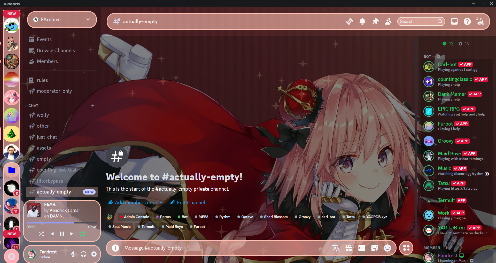

<h1  align="center"> Simple Astolfo Theme</h1>

A simple Astolfo theme for any modded discord client with CSS theming support
 

## Installing

### Vencord/BetterDiscord/Any modded discord client with CSS theming support

1. Download the [theme file](https://raw.githubusercontent.com/TheXploler/Astolfo-Theme/refs/heads/main/SimpleAstolfoTheme.theme.css).
2. Move the downloaded file into your theme folder.
3. Enable the theme in your theme settings.
4. Customize the theme by editing the file (Optional, yes it's a mess, I know)

### Install through link

1. Add `https://raw.githubusercontent.com/TheXploler/Astolfo-Theme/refs/heads/main/SimpleAstolfoTheme.theme.css` to your theme import links.

## Screenshots

No, I don't like Astolfo, shut up 
